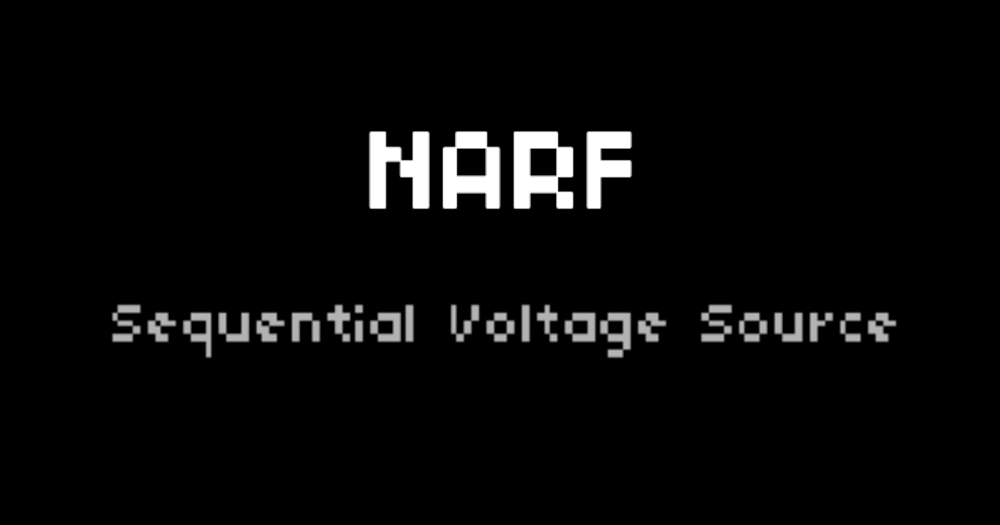
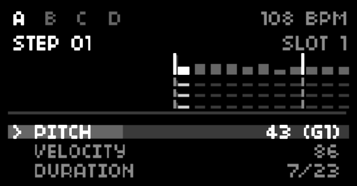

# **NARF**

### **Quad Sequential MIDI Source for Monome Norns**

NARF is a high-density, 4-channel MIDI sequencer inspired by the Buchla 251e. NARF utilizes rational fraction durations over predictable step grids, allowing for complex polyrhythms, tuplets, and "West Coast" rhythmic shifting in the style of the 251e, the MARF, and the Orthoganol Devices ER-101. It also has built-in support for the 16n and Korg NanoKontrol2, pitch randomization per step, and keyboard pitch input per step. 

Global quantization is enabled and accessible from the parameters menu.

NARF is a vibe coded with Google Gemini. ZORT!

### **Installation**: `;install https://github.com/rync/NARF.git`

## Features

* **Four Independent Tracks:** A, B, C, and D, each with 99 steps.  
* **Rational Durations:** Step lengths from 1/1 to 32/32.  
* **Proportional Timeline:** A visual playhead that scales step widths based on their rhythmic value.  
* **Assignable MIDI CCs:** Two independent, per-step MIDI CC destinations (0–127).  
* **10 Save Slots:** Store and recall up to 10 full project banks (4 tracks each) on the fly.  
* **Stochastic Nesting:** "Loop To" logic with repeat counts and probability-based breakouts.  
* **Global Visual Feedback:** High-fidelity loop-end markers and a screen-wide "Global Flash" on resets.  
* **Tactile Integration:** Pre-mapped for **16n Faderbank** and **Korg nanoKONTROL2**.

## Controls & Navigation

### Global Modifiers

| Key Combo           | Action                                                                 |
|:--------------------|:-----------------------------------------------------------------------|
| **K1 (Hold) \+ E1** | **Adjust Tempo:** From 20 to 300 bpm.                                  |
| **K1 (Hold) \+ E2** | **Track Select:** Switch active track (A, B, C, D).                    |
| **K1 (Hold) \+ K2** | **Jump to Edit:** Snap playhead to the step you are currently viewing. |
| **K1 (Hold) \+ K3** | **Global Transport:** Start/Stop all four tracks in sync.              |

### Sequential Editing

* **E1:** Scroll through the 99-step buffer.  
* **E2:** Cycle through Parameter rows.  
  * *Note:* On the **DURATION** row, turning E2 toggles focus between the **Numerator** and **Denominator**.  
* **E3:** Adjust value of the highlighted parameter.  
* **K2:** Toggle playback for the selected track.  
* **K3 (Short):** Stochastic Randomize (Pitch, Velocity, CC, and Duration).  
* **K3 (Long):** Save data to the currently active **Save Slot**.

### Parameter Guide

| Parameter | Logic |
| :---- | :---- |
| **PITCH** | MIDI Note 0-127. (Snaps if Quantize is ON). |
| **VELOCITY** | MIDI Velocity 0-127. |
| **DURATION** | Numerator/Denominator. Based on a $1/4$ note \= 1 beat. |
| **CC1/2 VALUE** | Value sent to CC1 or 2 when the step triggers (0-127). CC destinations are set per channel under the external Parameters menu. |
| **MODULATION** | Hardwired to the modwheel. |
| **ARTICULATION** | Gate length/Articulation (10% to 100% "Tie"). |
| **LOOP TO** | Step number to jump to. |
| **REPEATS** | Number of times to loop the jump. |
| **PROBABILITY** | % chance the step triggers or a loop occurs. |

## **Hardware Controllers**

**NARF** is designed to be programmed via external MIDI hardware to streamline the sequencing workflow. To begin programming, you must first enter **ARMED** mode.

* **Toggle Armed Mode:** Hold **K1** \+ press **K2**.  
* **Indicator:** A ● REC icon will appear on the norns screen when active.

**MIDI Keyboard Mapping**

When the script is **ARMED**, any incoming MIDI Note data targets the currently selected step (controlled by **E1**).

| Input | Target Parameter | Description |
| :---- | :---- | :---- |
| **Note On** | PITCH | Sets the base MIDI note for the step. |
| **Velocity** | VELOCITY | Sets the velocity value (0–127). |

**Fader & Knob Mapping (CC)**

NARF supports the **16n Faderbank** and **Korg NanoKontrol2** out of the box. Sliders and knobs map directly to the 11 step parameters.

| Parameter | 16n Fader (CC) | NanoKontrol2 | Description |
| :---- | :---- | :---- | :---- |
| **PITCH** | CC 32 | Fader 1 | Fine-tune the MIDI pitch. |
| **VELOCITY** | CC 33 | Fader 2 | Adjust note strength. |
| **DURATION** | CC 34 | Fader 3 | Sets the step numerator (1–32). |
| **CC1 VALUE** | CC 35 | Fader 4 | Send value to CC1 Destination. |
| **CC2 VALUE** | CC 36 | Fader 5 | Send value to CC2 Destination. |
| **MODULATION** | CC 37 | Fader 6 | Standard Mod Wheel (CC 1\) data. |
| **ARTICULATION** | CC 38 | Fader 7 | Note length/Gate percentage. |
| **GLIDE** | CC 39 | Fader 8 | Portamento time (if supported). |
| **LOOP TO** | CC 40 | Knob 1 | Step index to jump to. |
| **REPEATS** | CC 41 | Knob 2 | Number of times to loop. |
| **PROBABILITY** | CC 42 | Knob 3 | Chance (0–100%) of the jump. |

When **ARMED** is OFF, the script ignores all incoming MIDI Notes and CCs for programming purposes, allowing you to play along with your sequence without overwriting your data.

## Performance Cues

* **The Wall (|):** A vertical line indicates the Pattern End step set in the Params menu.  
* **The Triangle:** A bright marker above the playhead indicates you have reached the final step of the loop.  
* **The Flash:** The screen will pulse white whenever a track returns to its Pattern Start point.  
* **The \! Marker:** If the edit\_focus is on the final step of the loop, parameter labels change (e.g., PI\!) as a warning.

## Save Data

To switch save slots, go to **PARAMS \> NARF CONFIG \> SAVE/LOAD SLOT**. The slot is shown on the screen, and can be autosaved via hotkey.
